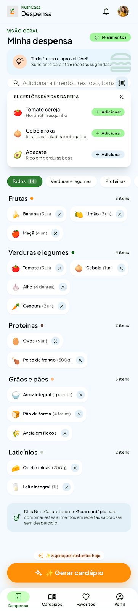
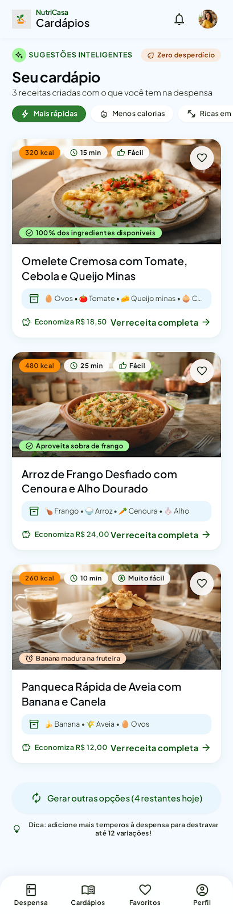
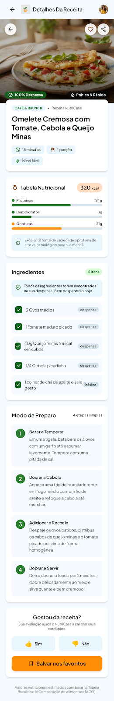
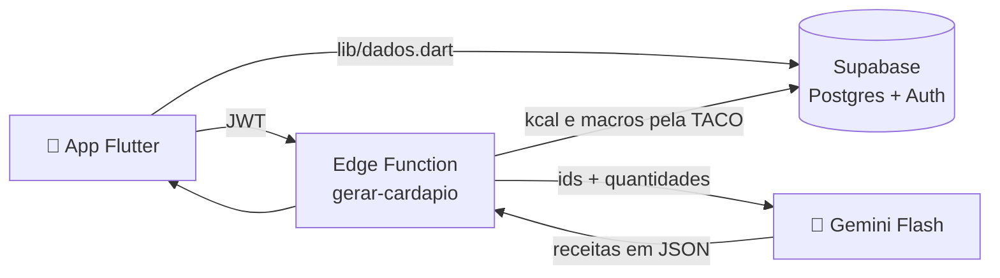

<div align="center">


# NutriCasa

**Cozinhe com o que você já tem.**

Cadastre o que está na sua despensa, receba receitas feitas com esses ingredientes e veja calorias e macros calculados pela Tabela TACO.

[](https://github.com/rafaellourenco10/app_gestao_alimentar/actions/workflows/testes.yml)


</div>

---

## Sobre

O NutriCasa ajuda quem quer cozinhar em casa sem desperdiçar comida. Você conta ao app o que tem na geladeira e no armário, e ele sugere três receitas que usam esses ingredientes. Os valores nutricionais **sempre** vêm da [TACO](https://www.cfn.org.br/wp-content/uploads/2017/03/taco_4_edicao_ampliada_e_revisada.pdf) (Tabela Brasileira de Composição de Alimentos), nunca de um número inventado pela IA.

> **Status:** o app está completo com dados locais (Fase 1). A conexão com Supabase (Fase 2) e a geração de receitas pelo Gemini (Fase 3) são os próximos passos. Detalhes em [PLANO.md](PLANO.md).

## Funcionalidades

| | |
|---|---|
| 🥫 **Despensa** | Busca nos 597 alimentos da TACO, quantidade opcional ("3 un", "500 g"), agrupamento por categoria e cadastro por **voz** |
| 📅 **Validade** | Aviso de vencimento no app e **notificação no celular**, mesmo com o app fechado |
| 🍳 **Cardápio** | 3 receitas com o que você tem, respeitando o limite de 5 gerações por dia |
| 📊 **Nutrição** | Calorias, proteínas, carboidratos, gorduras e fibras calculados pela TACO. As porções são ajustáveis e as quantidades recalculadas |
| 👩‍🍳 **Modo cozinhar** | Passo a passo em tela cheia, tela sempre acesa e timer por etapa |
| ✅ **"Cozinhei!"** | Desconta da despensa o que foi usado na receita |
| 🗓️ **Plano da semana** | Uma receita por dia e a lista de compras do que falta |
| 🛒 **Lista de compras** | Itens faltantes das receitas e itens manuais, para compartilhar no WhatsApp |
| ❤️ **Favoritos e histórico** | Histórico agrupado por Hoje, Ontem e Esta semana, além de 👍/👎 em cada receita |
| 🥗 **Preferências** | Vegetariano, sem lactose, sem glúten, alergias e meta de calorias |
| ➕ **Alimento fora da TACO** | Cadastro com kcal opcional (do rótulo), sugestões em "Você quis dizer…?" e aviso na receita quando falta dado |
| 📤 **Compartilhar** | A receita vira imagem para mandar a quem você quiser |
| 🌙 **Modo escuro** | Tema claro e escuro completos |
| 🔒 **Privacidade** | Política de privacidade completa, conforme a LGPD |

## Visual

O design segue os protótipos do Stitch em [`stitch_strategic_plan_execution/`](stitch_strategic_plan_execution/), com fundo off-white quente `#FAFAF7`, verde `#2E7D32` como cor primária, laranja `#FB8C00` nas ações principais e a fonte Plus Jakarta Sans.

<div align="center">
<table>
<tr>
<td align="center" valign="top"><br/><sub>Despensa</sub></td>
<td align="center" valign="top"><br/><sub>Cardápio</sub></td>
<td align="center" valign="top"><br/><sub>Receita</sub></td>
</tr>
</table>
<sub>Protótipos de design (Stitch). O app final usa o fundo <code>#FAFAF7</code>.</sub>
</div>

## Como funciona



1. O app envia apenas os **ids da TACO** e as quantidades da despensa. Nenhum dado pessoal vai para a IA.
2. O Gemini devolve as receitas num JSON com schema fixo, usando só esses ids e os básicos (sal, óleo e água).
3. A Edge Function calcula calorias e macros (`gramas × valor por 100 g ÷ 100`) e ignora qualquer número vindo da IA.
4. **A chave do Gemini nunca fica no app.** Ela existe só na Edge Function.

## Arquitetura

Todo acesso a dados passa por **um único arquivo**, [`lib/dados.dart`](lib/dados.dart), com funções simples como `listarDespensa()`, `adicionarItem()`, `gerarCardapio()` e `favoritar()`. Hoje essas funções usam dados locais. Na Fase 2 o corpo delas passa a chamar o Supabase, **e as telas não mudam**.

```
lib/
├── main.dart              # inicialização, abas e Sentry opcional
├── dados.dart             # camada única de dados (TACO, despensa, receitas)
├── tema.dart              # cores, fonte e raios (claro e escuro)
├── avisos.dart            # notificações de validade
├── busca_alimento.dart    # busca na TACO e "Você quis dizer…?"
├── voz_sheet.dart         # cadastro por voz
├── widgets.dart           # componentes compartilhados
└── telas/                 # login, despensa, cardápio, receita, cozinhar,
                           # plano, compras, favoritos, histórico, perfil…
assets/
├── taco.json              # 597 alimentos da TACO
├── fotos/                 # fotos por tipo de prato (CC0 / domínio público)
└── privacidade.md         # política de privacidade
```

## Stack

| Camada | Tecnologia |
|---|---|
| App | Flutter (Android e iOS), estado com `setState` |
| Dados nutricionais | TACO em JSON, dentro do app |
| Backend *(Fase 2)* | Supabase: Postgres com RLS, Auth e Edge Functions |
| IA *(Fase 3)* | Gemini Flash com `responseSchema` |
| Erros | Sentry (opcional) |
| CI | GitHub Actions: `flutter analyze` + `flutter test` |

## Começando

**Pré-requisitos:** [Flutter 3.44+](https://docs.flutter.dev/get-started/install) e um celular Android ou iOS com depuração USB ativada.

```bash
git clone https://github.com/rafaellourenco10/app_gestao_alimentar.git
cd app_gestao_alimentar
flutter pub get
flutter run
```

O app funciona inteiro **sem internet e sem conta**: os dados são locais nesta fase.

### Relatório de erros (opcional)

```bash
flutter run --dart-define=SENTRY_DSN=https://sua-chave@sentry.io/123
```

Sem a chave, o Sentry fica desligado.

### Ícone e tela de abertura

Depois de trocar o logo:

```bash
dart run flutter_launcher_icons && dart run flutter_native_splash:create
```

## Testes

```bash
flutter analyze
flutter test
```

A suíte cobre o cálculo de macros, a busca, o limite diário, a validade, as listas de compras, o plano da semana, o cadastro por voz, o modo escuro e o fluxo completo num celular de tela pequena. Todo push roda a suíte no GitHub Actions.

## Roadmap

- [x] **Fase 0:** setup
- [x] **Fase 1:** app completo com dados locais
- [x] **Fase 1.5:** porções, modo cozinhar, validade, voz, compartilhar, modo escuro e outras melhorias
- [x] **Fase 1.6:** ícone, fotos, LGPD, CI, preferências, notificações e plano da semana
- [x] **Fase 1.7:** alimentos fora da TACO
- [ ] **Fase 2:** Supabase (login real, despensa sincronizada e RLS)
- [ ] **Fase 3:** receitas geradas pelo Gemini
- [ ] **Fase 4:** publicação no teste interno da Google Play

## Créditos

- **TACO:** dados convertidos de [raulfdm/taco-api](https://github.com/raulfdm/taco-api) (MIT).
- **Fotos:** Wikimedia Commons, CC0 e domínio público. A lista completa está em [CREDITOS_FOTOS.md](CREDITOS_FOTOS.md).

> ⚠️ Os valores nutricionais são estimativas e não substituem a orientação de um nutricionista.

<div align="center">
<sub>Feito com 💚 no Brasil</sub>
</div>
